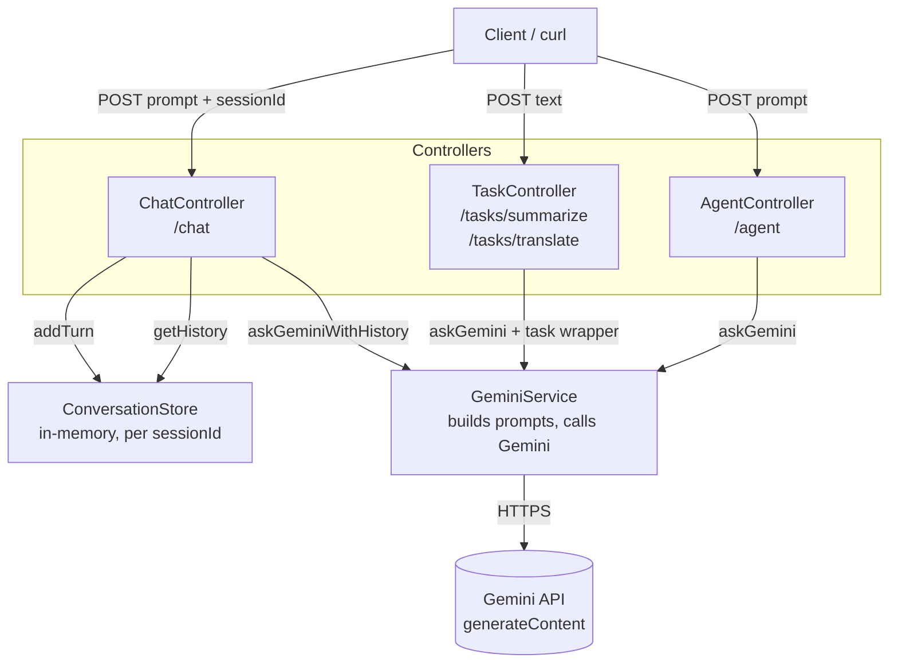

# AI Spring Boot Demo

A Spring Boot application integrating Google's Gemini API, with support for single-turn Q&A, multi-turn chat memory, and task-specific endpoints (summarization, translation).

## Features

- **`/agent`** — single-turn prompt → Gemini response
- **`/chat`** — multi-turn conversation with session-based history (`ConversationStore`)
  - `DELETE /chat/{sessionId}` — clear a session's history
- **`/tasks/summarize`** — summarize text into bullet points
- **`/tasks/translate`** — translate text to a target language
- Configurable response `style` (`brief` / `detailed`)

## Tech Stack

- Java, Spring Boot
- Spring WebFlux `WebClient` for calling the Gemini API
- Jakarta Bean Validation (`@Valid`, `@NotBlank`)
- In-memory session store (`ConcurrentHashMap` + `CopyOnWriteArrayList`)

## Architecture

The app follows a standard layered Spring Boot structure: controllers handle HTTP concerns and validation, a single service owns all Gemini API calls, and a store component manages conversation state.



### Request flow — single-turn (`/agent`)
1. `AgentController` validates `PromptRequest` and calls `GeminiService.askGemini(prompt)`.
2. `GeminiService` wraps the prompt with a fixed style instruction, calls Gemini's `generateContent` endpoint via `WebClient`, and extracts the text from the response.
3. Errors from Gemini (`WebClientResponseException`) or unexpected failures are caught and re-thrown as a generic `RuntimeException`, handled by `@ExceptionHandler` to return HTTP 503.

### Request flow — multi-turn (`/chat`)
1. `ChatController` looks up prior turns for the given `sessionId` from `ConversationStore`.
2. History + new prompt are passed to `GeminiService.askGeminiWithHistory`, which builds Gemini's `contents` array with alternating `"role": "user"` / `"role": "model"` entries so Gemini has full conversational context.
3. After the response comes back, both the user's prompt and Gemini's answer are appended to the session's history.
4. History is capped at `MAX_TURNS` (20) per session to bound token usage on each call.

### Design decisions

- **Service layer owns all Gemini-specific logic** (prompt construction, style handling, response parsing). Controllers stay thin — no HTTP/JSON details about Gemini leak into them.
- **Session state is isolated in `ConversationStore`**, not the service, so the service stays stateless and easy to test. `ConcurrentHashMap` + `CopyOnWriteArrayList` allow safe concurrent access across sessions.
- **Style is a first-class parameter** (`brief` / `detailed` / default), resolved with a `switch` in the service rather than string concatenation scattered across controllers.
- **Task endpoints (`/tasks/*`) reuse `askGemini` rather than duplicating HTTP-call logic** — they only differ in how the prompt is wrapped.
- **Secrets are never hardcoded** — the API key is injected via `${GEMINI_API_KEY}`, with `application.yml` gitignored and `application.yml.example` committed as a template (see the git notes below for why this matters).

### Known architectural limitations

- `ConversationStore` is in-memory only: history is lost on restart and isn't shared across multiple app instances. Swapping in a Redis-backed store would fix both without changing the controller/service contracts.
- No rate limiting or per-user auth yet — anyone who can reach the endpoints can rack up Gemini API usage.
- No caching layer — identical prompts still hit Gemini every time.

## Setup

### 1. Get a Gemini API key
Create one in [Google AI Studio](https://aistudio.google.com/app/apikey).

### 2. Configure the key via environment variable (do NOT hardcode it)

`src/main/resources/application.yml`:
```yaml
gemini:
  api:
    key: ${GEMINI_API_KEY}
```

On Windows PowerShell (per session):
```powershell
$env:GEMINI_API_KEY="your-key-here"
```

Or set it permanently via System Properties → Environment Variables, then restart IntelliJ.

A template without secrets is provided in `application.yml.example` — copy it and fill in your own key locally.

### 3. Run

```powershell
mvn spring-boot:run
```

## Example requests (Windows `cmd.exe`)

Single-turn:
```
curl -X POST http://localhost:8080/agent -H "Content-Type: application/json" -d "{\"prompt\":\"Explain Kafka in one paragraph\"}"
```

Multi-turn chat:
```
curl -X POST http://localhost:8080/chat -H "Content-Type: application/json" -d "{\"prompt\":\"My name is Carrie\",\"sessionId\":\"abc123\"}"
curl -X POST http://localhost:8080/chat -H "Content-Type: application/json" -d "{\"prompt\":\"What is my name?\",\"sessionId\":\"abc123\"}"
```

Summarize:
```
curl -X POST http://localhost:8080/tasks/summarize -H "Content-Type: application/json" -d "{\"text\":\"...\"}"
```

Translate:
```
curl -X POST http://localhost:8080/tasks/translate -H "Content-Type: application/json" -d "{\"text\":\"Hello\",\"targetLanguage\":\"French\"}"
```

## Known limitations

- `ConversationStore` is in-memory only — history is lost on restart and won't work across multiple app instances. A Redis-backed store would fix both.

---

## Git notes: recovering from a leaked API key in commit history

If GitHub push protection blocks a push with `GH013: Repository rule violations found ... Push cannot contain secrets`, it means a secret (e.g. a GCP/Gemini API key) is present in one of the commits being pushed — even if it's since been removed in a later commit, it's still reachable in history.

**Immediately rotate/revoke the leaked key** in Google Cloud Console / AI Studio regardless of what happens with git — a key that touched a commit should be treated as compromised.

### If the branch has never been successfully pushed before
Safe to wipe local history and start clean:

```powershell
# 1. Confirm .git actually gets removed (should error "Cannot find path" after)
dir -Force .git
Remove-Item -Recurse -Force .git
dir -Force .git

# 2. Re-init — must say "Initialized empty Git repository", NOT "Reinitialized"
git init

# 3. Confirm the secret is gone from working files (Gemini/GCP keys start with "AIza")
Select-String -Path src\main\resources\application.yml -Pattern "AIza"

# 4. Stage, commit, push
git add .
git commit -m "Initial commit"
git branch -M main
git remote add origin https://github.com/carrieyanzh/aispringboot.git
git push -u origin main --force
```

Check if the remote already has commits before force-pushing:
```powershell
git ls-remote origin main
```

### Prevent secrets from being committed again

`.gitignore`:
```
application.yml
```

Commit a template instead (`application.yml.example`) with a placeholder value, and load the real key from an environment variable at runtime (see Setup above).

### Gotchas encountered

- `git init` on an existing `.git` folder says **"Reinitialized existing Git repository"** — this does NOT clear history. The old `.git` folder must actually be deleted first.
- Running multi-line PowerShell commands can queue oddly (`>>` prompts) if pasted incorrectly — run one command at a time and check output before proceeding.
- `--force` push is safe only when you've confirmed (via `git ls-remote`) that the remote doesn't hold anything you need to keep.
